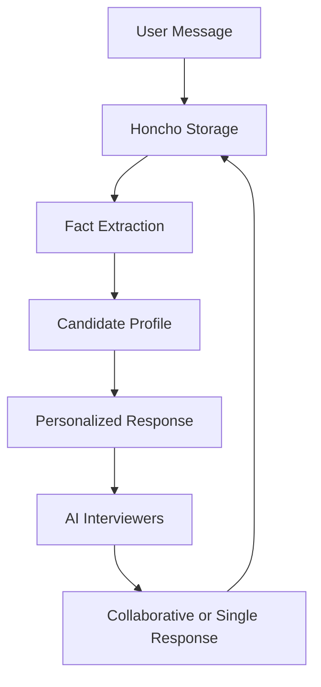
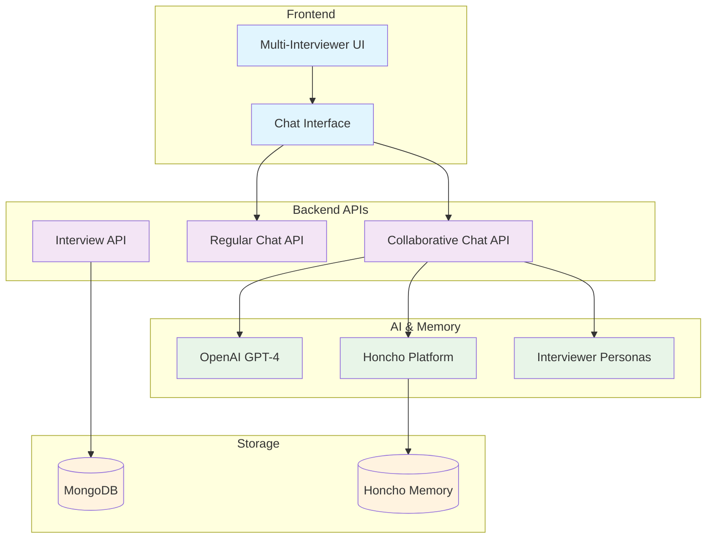

# Honcho Multi-Interviewer Integration

This document explains the Honcho integration that enables collaborative AI interviews with memory and personalization.

## Overview

The interview application now supports **two AI interviewers working together**:

- **Jordan (Soft Interviewer)** 😊 - Empathetic, supportive, focuses on cultural fit and communication
- **Alex (Hard Interviewer)** 🤔 - Analytical, challenging, focuses on technical skills and problem-solving

## Features

### 🧠 Memory & Personalization

- **Persistent Memory**: Conversations are stored across sessions using Honcho
- **Learned Facts**: System automatically learns and remembers facts about candidates
- **Personalized Responses**: Questions adapt based on previous interactions
- **Cross-Session Context**: Interviewers remember candidates from previous interviews

### 🤝 Collaborative Intelligence

- **Dynamic Interaction**: Interviewers take turns or collaborate based on context
- **Complementary Perspectives**: Soft interviewer provides support while hard interviewer challenges
- **Intelligent Switching**: System determines when to use single vs collaborative responses
- **Theory of Mind**: Each interviewer can observe and learn from the other's interactions

## How It Works

### 1. Interview Setup

When creating an interview, users can toggle "Collaborative AI Panel":

- ✅ **Enabled**: Two AI interviewers work together
- ❌ **Disabled**: Single traditional interviewer (backward compatible)

### 2. Interviewer Personas

#### Jordan (Soft Interviewer)

- **Role**: Behavioral Interviewer
- **Personality**: Warm, understanding, collaborative
- **Focus**: Cultural fit, communication skills, team dynamics
- **Question Style**: Open-ended, supportive, encouraging

#### Alex (Hard Interviewer)

- **Role**: Technical Interviewer
- **Personality**: Analytical, direct, challenging
- **Focus**: Technical skills, problem-solving, critical thinking
- **Question Style**: Specific, challenging, detail-oriented

### 3. Collaborative Modes

The system intelligently chooses between:

#### **Collaborative Response** (Both interviewers)

- Opening introductions
- Complex answers needing both technical and behavioral follow-up
- Section transitions
- Every 3-4 exchanges to maintain collaboration

#### **Single Interviewer Response**

- Technical sections → Alex leads
- Behavioral sections → Jordan leads
- Alternating pattern when section focus is unclear

### 4. Memory Integration



## Technical Implementation

### Core Components

1. **HonchoInterviewManager** (`lib/honcho-client.ts`)

   - Manages Honcho workspace, peers, and sessions
   - Handles message storage and retrieval
   - Extracts learned facts about candidates

2. **Collaborative Chat API** (`app/api/chat/collaborative/route.ts`)

   - Determines response mode (collaborative vs single)
   - Manages interviewer personas and context
   - Integrates with Honcho for memory storage

3. **Multi-Interviewer UI** (`components/multi-interviewer-display.tsx`)
   - Shows interviewer personas and active states
   - Parses and displays collaborative messages
   - Provides visual feedback for interview mode

### API Flow

```typescript
// 1. User enables collaborative mode
const config = {
  useMultiInterviewers: true,
  // ... other config
};

// 2. Interview creation with Honcho workspace
const interview = await createInterview({
  ...config,
  metadata: {
    useMultiInterviewers: true,
    honchoWorkspaceId: `interview-${Date.now()}`,
  },
});

// 3. Chat API routes to collaborative endpoint
if (useMultiInterviewers) {
  // Use collaborative chat API with Honcho integration
  const response = await collaborativeChatAPI({
    messages,
    interviewState,
    honchoWorkspaceId,
    candidateId,
  });
}
```

## Configuration

### Environment Variables

Add to your `.env.local`:

```bash
# Honcho Configuration (for AI memory and personalization)
HONCHO_BASE_URL=https://demo.honcho.dev
HONCHO_ENVIRONMENT=demo
```

### Enabling Multi-Interviewer Mode

1. **In Start Interview Dialog**: Toggle "Collaborative AI Panel"
2. **Programmatically**: Set `useMultiInterviewers: true` in interview config
3. **API**: Pass `useMultiInterviewers: true` in request body

## Message Format

### Single Interviewer

```
Regular message from one interviewer
```

### Collaborative Response

```
**Jordan:** [Supportive question or comment]

**Alex:** [Technical challenge or follow-up]
```

## Benefits

### For Candidates

- **More Comprehensive Evaluation**: Both soft and hard skills assessed
- **Balanced Experience**: Support balanced with appropriate challenge
- **Realistic Simulation**: Mimics real panel interviews
- **Personalized Journey**: Experience improves over multiple sessions

### For Organizations

- **Better Assessment**: Multi-dimensional evaluation of candidates
- **Consistent Experience**: Standardized interview process
- **Learning System**: Improves over time with more interactions
- **Scalable Solution**: AI panel available 24/7

## Backward Compatibility

The system maintains full backward compatibility:

- Existing single-interviewer interviews continue working unchanged
- Default behavior remains single interviewer unless explicitly enabled
- All existing APIs and components work as before
- Database schema extended without breaking changes

## Testing

Run the integration test:

```bash
node scripts/test-honcho-integration.js
```

This tests:

- Honcho workspace creation
- Interviewer peer setup
- Session management
- Message storage and retrieval
- Fact extraction
- Session cleanup

## Troubleshooting

### Common Issues

1. **Honcho Connection Failed**

   - Check internet connection
   - Verify HONCHO_BASE_URL is correct
   - Ensure demo server is accessible

2. **Collaborative Mode Not Working**

   - Verify `useMultiInterviewers` is set to `true`
   - Check that collaborative chat API is being called
   - Ensure interview metadata includes multi-interviewer flag

3. **Messages Not Parsing**
   - Check message format includes `**Name:**` prefix
   - Verify InterviewerMessage component is used
   - Look for parsing errors in browser console

### Debug Mode

Enable debug logging by adding to your environment:

```bash
DEBUG=honcho:*
```

## Future Enhancements

Potential improvements:

- **Custom Interviewer Personas**: Allow users to define their own interviewer types
- **Industry-Specific Panels**: Different interviewer combinations for different roles
- **Real-time Collaboration**: Interviewers can interrupt or build on each other mid-response
- **Sentiment Analysis**: Adjust interviewer behavior based on candidate emotional state
- **Multi-Language Support**: Interviewers that can conduct interviews in different languages

## Architecture Diagram



This integration transforms the interview experience from a single AI interaction into a comprehensive, memorable, and personalized interview panel that learns and adapts over time.
